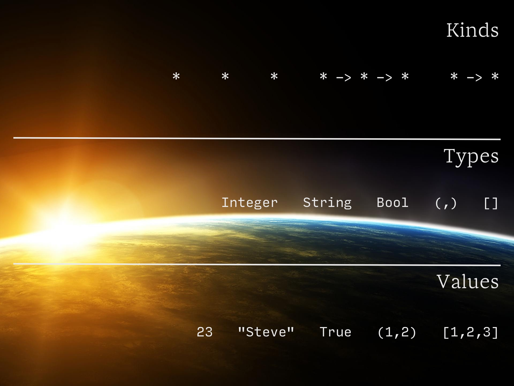

theme: Next, 1
build-lists: true
autoscale: true

# [fit] Haskell
# syntax, strings, and basic datatypes

^ Note: This presentation is designed to be viewed with [http://www.decksetapp.com/](http://www.decksetapp.com/).

---

# portals

- haskell.org
- ~~haskell.org~~
- haskell-lang.org

---

# tools

- GHC (compiler)
- GHCi (REPL, i.e. **R**ead-**E**val-**P**rint-**L**oop)
- Cabal (**C**ommon **A**rchitecture for **B**uilding **A**pplications and **L**ibraries)
- Haddock (documentation)

---

# build systems

- Haskell Platform
- Hackage
- cabal-install
- ~~Haskell Platform~~
- ~~Hackage~~
- ~~cabal-install~~
- Stack

---

# Stack

The primary stack design point is reproducible builds. If you run `stack
build` today, you should get the same result running `stack build` tomorrow.

- LTS (Long Term Support) snapshots
- LTS Haskell 7.1 supports GHC 8.0.1
- LTS Haskell 6.2 supports GHC 7.10.3
- Stackage
- separation of project and global configurations
- global install is fine for learning
- See `study-haskell-nyc/resources/haskell-stack-notes.md` on the GitHub repo for install notes

---

# Hoogle

- `haskell.org/hoogle`
- `hoogle.haskell.org`
- `hayoo.fh-wedel.de`
- `stackage.org/lts-7.1/hoogle`

- Search for: `>>=`
- Google: "Your search - >>= - did not match any documents."
- Hoogle: `(>>=) :: Monad m => m a -> (a -> m b) -> m b`
- Stackage: `(>>=) :: forall a b . Monad m => m a -> (a -> m b) -> m b`

---

# text editors

- vim: `github.com/eagletmt/ghcmod-vim`
- neovim: `github.com/neovimhaskell`
- Emacs: `commercialhaskell.github.io/intero`
- Atom: `github.com/atom-haskell`
- Sublime: `github.com/SublimeHaskell/SublimeHaskell`
- Yi: `yi-editor.github.io`

---

# Prelude

- `GHC.Base` package
- "standard library"
- BasePrelude
- Protolude
- Rebase
- BasicPrelude
- ClassyPrelude
- ClassyPrelude.Yesod
- `{-# LANGUAGE NoImplicitPrelude #-}`
- import _Prelude_

---

# GHCi commands

- `:help` or `:?`
- `:browse`
- `:load` or `:l` and `:reload` or `:r`
- `:module` or `:m`
- `:set`
- `:!`
- `:quit` or `:q`

---

# GHCi commands (continued)

- `:info` or `:i`
- `:type` or `:t`
- `:kind` or `:k`
- `:print` and `:sprint`
- `:{` and `:}`

---

# GHC vs. GHCi

**GHC 7.10.3**

GHCi:
`let triple x = x * 3`

source files:
`triple x = x * 3`

**GHC 8.0.1**

GHCi and source files:
`triple x = x * 3`

>  Novices are often confused when they are told that they have to use one syntax for definitions in modules and another in ghci.

---

# evaluation

- `(λn. λm. λf. λx. n f(m f x))(λf. λx. f(x))(λf. λx. f(x))` =  `(λf. λx. f(f(x)))`
- `(+) 1 1` = `2`
- redex
- `1 + 1`
- `(1 + 1, 2 + 2)`
- `(\x -> x + 1) 1` 
- normal form
- `1`
- `(1, 2)`
- `\x -> x + 1`
- weak head normal form
- `(1 + 1, 2)`
- `\x -> 1 + 1`

---

# weak head normal form

- `x = 1 :: Integer`
- `p = (,) (x + x) x`
- `:print p`
- `p = (_t1::(Integer, Integer))`
- `:sprint p`
- `p = _`
- `p`
- `(2,1)`
- `:print p` or `:sprint p`
- `p = (2,1)`

---

# operators

- `1 + 2`
- `(+) 1 2`
- `2 * 3 * 4`
- `(2 * 3) * 4`
- `2 + 3 * 4`
- `(2 + 3) * 4`

---

# functions

- `f x`
- `1 + 1`
- `(+) 1 1`
- `((+) 1) 1`
- `λx. x`
- `\x -> x`
- `f x = x`
- `f x = x + 1`
- `g x = x - 1`
- `f g 1`
- ~~`f g 1`~~
- `f (g 1)`

---

# $

- `($) :: (a -> b) -> a -> b`
- `f $ x = f x`
- `($) f x`
- `f (g (h x))`
- `f $ g $ h x`
- `fst (swap (1,2))`
- `fst $ swap (1,2)`
- `($) fst (swap (1,2))`
- `($) fst $ swap (1,2)`
- `zipWith ($) [(+3),(+2),(+1)] [1,2,3]`

---

# let vs. where

```haskell
let x = 2
    y = 3
    z = 4
in x * y * z

f = let x = 2; y = 3; z = 4 in x * y * z

f = x * y * z where x = 2; y = 3; z = 4

f x
  | x < 0  = y - x
  | x == 0 = y
  | x > 0  = x - y
  where y = 100
```

---

# let vs. where (continued)

```haskell
steveLikes "" = False
steveLikes item
  | item `elem` favorites = True
  | otherwise = False
  where favorites = ["pizza", "beer", "Haskell"]

steveLikes item = let favorites = ["pizza", "beer", "Haskell"] in
  if item `elem` favorites then True else False

steveLikes item = case item of
                    "pizza"   -> True
                    "beer"    -> True
                    "Haskell" -> True
                    otherwise -> False
```

---

# if-then-else

- _P E<sub>1</sub> E<sub>2</sub>_
- _if (condition) then (expression 1) else (expression 2)_
- `if p then e1 else e2`
- `(λx. x (λx. λy. y)(λa. a (λx. λy. y)(λx. λy. x))(λx. λy. y))`
- `isZero 0 = (λx. λy. x) ≡ true`
- `(isZero 0)(λx. λy. y)(λx. λy. x) ≡ (isZero 0)(false)(true) = false`
- `isZero :: (Num a, Eq a) => a -> Bool`  
  `isZero x = if x == 0 then True else False`
- `if isZero 0 then False else True`
- `let x = 1 in if isZero x then False else True`

---

# strings

- `Char` vs. `[Char]` vs. `String`
- `s` 
- `"Steve"`
- `['S','t','e','v','e']`
- `'S' : 't' : 'e' : 'v' : 'e' : []`
- `"Steve" ++ " " ++ "Syrek" == concat ["Steve", " ", "Syrek"]`
- `"Steve" ++ "" == "" ++ "Steve"`

---

# datatypes

- terms or values
- types
- kinds
- `data Cake = Lie`
- `data Izzard = Cake | Death`
- `data Budo = Budo Style School`

---

# algebraic datatypes

## sum types

`data Sum = Constant | Constant` = `Constant` + `Constant`

```rust
enum Boolean {
   True,
   False,
}
```

```haskell
data Bool = False | True
data Small = IntEight Int8 | IntSixteen Int16
```

(False = 1) + (True = 1) = 2
(IntEight = 256) + (IntSixteen = 65536) = 65792

---

# algebraic datatypes

## product types

`data Product = Constructor Constant Constant` = `Constant` * `Constant`

```rust
struct Point {
  x: i8,
  y: i8,
}
```

```haskell
data Point = Point Int8 Int8

data Pair a b = Pair a b

data (,) a b = (,) a b
```

(Point Int8 = 256) * (Point Int8 = 256) = 65536
(Pair a) * (Pair b) = a * b

---

# algebraic datatypes

## function as exponent type

`exponent :: (a -> b)` = `b`<sup>`a`</sup>

```haskell
data Day = Sunday | Monday | Tuesday | Wednesday | Thursday | Friday | Saturday

dayOff :: Day -> Bool
dayOff Saturday = True
dayOff Sunday   = True
dayOff        _ = False
```

(Bool = 2) ^ (Day = 7) = 2<sup>7</sup> = 128

---

# the type universe



---

# type signatures

- `:t concat`
- `concat :: Foldable t => t [a] -> [a]`
- `:t (+)`
- `(+) :: Num a => a -> a -> a`
- `:t (,)`
- `(,) :: a -> b -> (a, b)`
- `:t []`
- `[] :: [t]`
- `:t (:)`
- `(:) :: a -> [a] -> [a]`
- `:k (->)`
- `(->) :: * -> * -> *`

---

# tuples

- `data (,) a b = (,) a b` = `data (a,b) = (a,b)`
- `() :: ()`
- `(,) :: a -> b -> (a, b)`
- `(,,) :: a -> b -> c -> (a, b, c)`
- `(,,,) :: a -> b -> c -> d -> (a, b, c, d)`
- `(,,,,,,,,,,,,,,,,,,,,,,,,,,,,,,,,,,,,,,,,,,,,,,,,,,,,,,,,,,,,,) a b c d e f g h i j k l m n o p q r s t u v w x y z a1 b1 c1 d1 e1 f1 g1 h1 i1 j1 k1 l1 m1 n1 o1 p1 q1 r1 s1 t1 u1 v1 w1 x1 y1 z1 a2 b2 c2 d2 e2 f2 g2 h2 i2 j2`
- `fst :: (a, b) -> a`
- `fst ("pizza", pi)`
- `"pizza"`
- `snd :: (a, b) -> b`
- `snd ("pizza", pi)`
- `3.141592653589793` 

---

# lists

- `data [] a = [] | a : [a]` 
- `[] :: [t]`
- `t (:)`
- `(:) :: a -> [a] -> [a]`
- `data List a = EmptyList | ListElement a (List a) deriving Show`
- `xs = ListElement 1 (ListElement 2 (ListElement 3 (EmptyList)))`
- `xs`
- `ListElement 1 (ListElement 2 (ListElement 3 EmptyList))`
- `ys = 1 : 2 : 3 : []`
- `ys = 1 : (2 : (3 : ([])))`
- `ys`
- `[1,2,3]`
- `(x:xs)`

---

# type classes


---

# conventions

Haskell (confusing):

```
map :: (a -> b) -> [a] -> [b]
map _ [] = []
map f (a:as) = f a : map f as
```

Pseudo-code (disambiguation of types):

```
map : (α -> β) -> [α] -> [β]
map _ [] = []
map f (a:as) = f a : map f as
```

Haskell (conventional):

```
map :: (a -> b) -> [a] -> [b]
map _ [] = []
map f (x:xs) = f x : map f xs
```

---

# terminology

- functions, arguments, and parameters
- arity (nullary, unary, binary, ternary, etc.)
- expressions vs. declarations
- pattern matching
- values/terms vs. types vs. kinds
- data declarations
- type signatures and type variables
- type constructors vs. data constructors
- partial application
- currying
- sectioning
- lazy evaluation
- polymorphism (ad-hoc, parametric, constrained)

---

# bonus - you already know monad

- `x = 1`
- `x = (\x -> x) 1`
- `x = (λx. x)(λf. λx. f(x))`
- `x = id 1`
- `x = (\x -> x + 1) 1`
- `x = (+ 1) 1`
- `x = [1]`
- `x = [1] >>= \x -> [x]`
- `x = [1] >>= \x -> [x + 1]`

